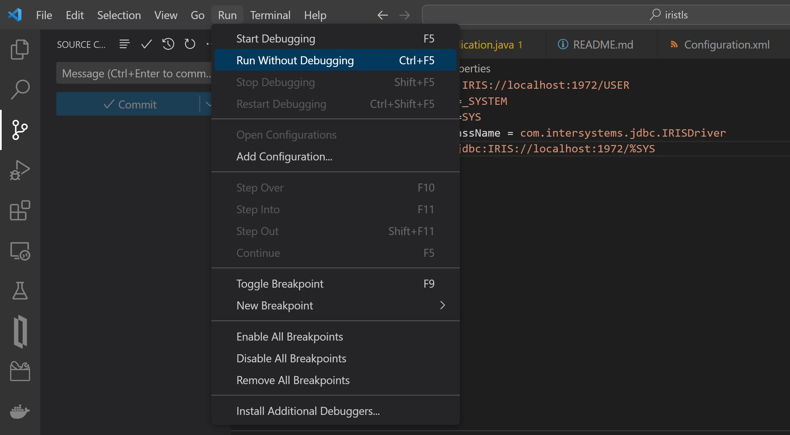

# JAVA JDBC and SSL/TLS connections
## Prerequisites:

To test this project is required to install:

1. [Apache Maven](https://dlcdn.apache.org/maven/maven-3/3.9.1/binaries/apache-maven-3.9.1-bin.zip)
2. [Windows Openssl](https://slproweb.com/download/Win64OpenSSL_Light-3_1_0.exe)
3. [Java JDK 11](https://www.oracle.com/es/java/technologies/javase/jdk11-archive-downloads.html#license-lightbox)
4. [Visual Studio Code](https://code.visualstudio.com/download)

## Configuration:

InterSystems jdbc library is not uploaded into Maven Repository so we have to install it into our local Maven repository. To do it we have to create c:\Certificados folder and copy **intersystems-jdbc-3.6.1.jar** into it. The next step is to execute the following command:

```bash
mvn install:install-file -Dfile=c:\\Certificados\\intersystems-jdbc-3.6.1.jar -DgroupId=com.intersystems -DartifactId=intersystems-jdbc -Dversion=3.6.1 -Dpackaging=jar
```
Please, confirm that a new folder has been created in the local repository (similar to `C:\Users\username\.m2\repository\com\intersystems\intersystems-jdbc\3.6.1`)

This code is a Java project based on MAVEN so we just need to execute `mvn clean install` to confirm that we have installed all the dependencies of the project.

Finally, we have to configure two environment variables in the system:
1. JAVA_HOME: path to java JDK installation (bin folder excluded).
2. OPENSSL_HOME: path to OpenSSL installation (bin folder included).

### application.properties

In this file we will configure the JDBC data to connect with our IRIS instance, please, review and update it to use your own instance (review %SuperServer port, usually 1972).

### SSLConfig.properties

This file contains the parameters requested to establish SSL/TLS connections. No further changes are necessary.

### Configuration.cls

You will find in this file an exported objectscript class. The system will import it into your IRIS instance and create all the configurations to establish SSL/TLS connections automatically. This class contains a class method invoke from the java code to create the test table Phonebook.Company located in User namespace.

You can check these changes from the Management Portal accesing from System Administration -> Security -> SSL/TLS Configurations:


We have created a new configuration available to be used by %SuperServer port. Let's check the configuration in detail:


As you can see this configuration is defined as a server type, in this case IRIS is working as a server and the Java project as a client. The server's credentials are configured with the local paths "c:\Certificados".

The last step to be checked is the configuration of the %SuperServer port to accept SSL/TLS connections. We can access to this configuration from the Management Portal Administration -> Security -> System Security -> System-wide Security Parameters.


## Running the project:

Visual Studio Code detects automatically the type of the project, you only have to open **RUN** menu and click on **Run Without Debug**. 



The project is configured to create certificates and keys in c:\Certificados folder and configure the SSL/TLS connections in IRIS. When the configuration is finished a connection is opened with IRIS and a SQL query is executed. 


